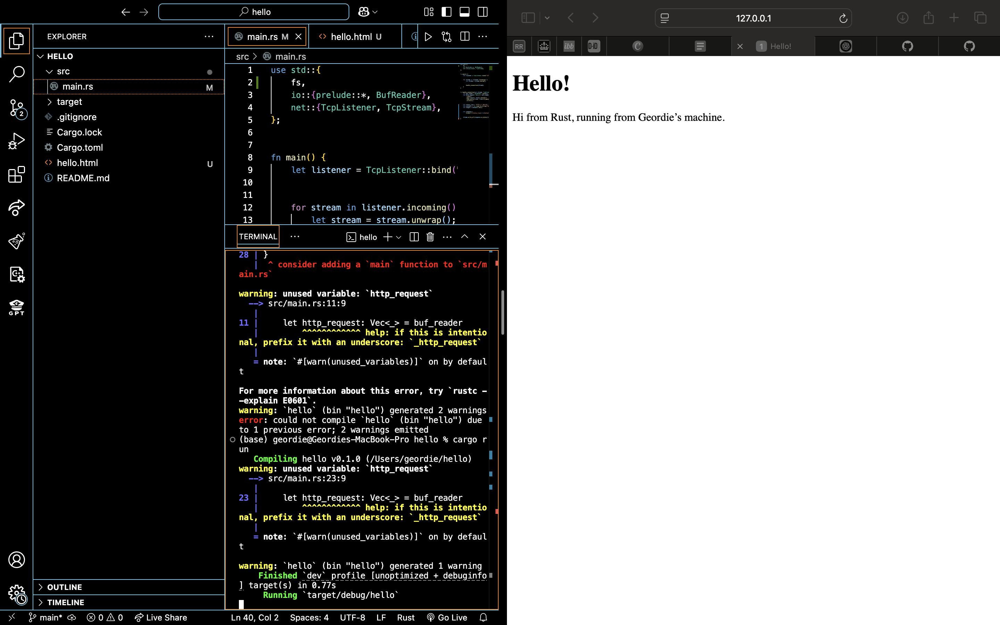
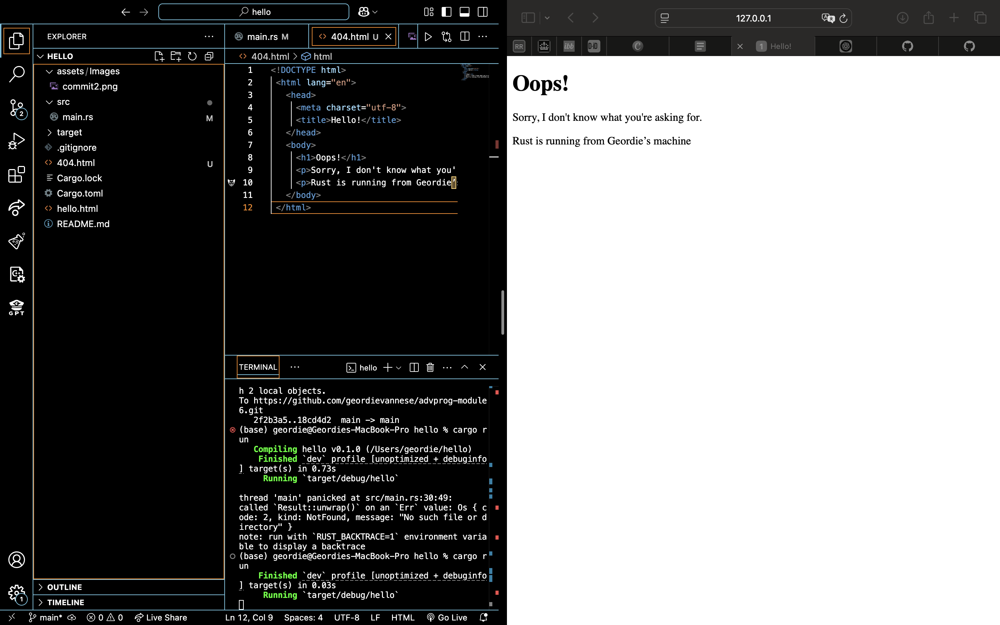

# module 6

## Commit 1 Reflection notes
To process incoming HTTP requests from a web browser, I wrapped the TCP stream with a BufReader. This makes it possible to read the stream line by line using .lines(), where each line corresponds to a different part of the HTTP request (for example, the method, path, or headers).

Next, I used .map(|line| line.unwrap()) to convert the iterator from Result<String> into String, and then applied .take_while(|line| !line.is_empty()) to stop reading when it hits the first empty line—this marks the boundary between the headers and the request body in HTTP.

Finally, by collecting these lines into a Vec<String>, I got a clear, line-by-line view of how a browser sends a request to the server, which helped me better understand the low-level structure of HTTP requests.

## Commit 2 Reflection Notes

I discovered how to serve a proper HTML file instead of just plain text by adjusting the handle_connection method. Using fs::read_to_string() made it straightforward to load the contents of hello.html into memory, and by including the correct headers along with the file’s contents in the HTTP response, browsers could render the page correctly.

I also learned the importance of the Content-Length header. Leaving it out can cause some browsers to display the page incorrectly. Moreover, I realized that an HTTP response must follow a specific format, starting with a status line (e.g., HTTP/1.1 200 OK), then headers, an empty line, and finally the response body.

## Commit 3 Reflection Notes

I implemented logic in the handle_connection method that conditionally returns different responses based on the request path. The idea is to inspect the request line from the browser and serve the appropriate page: if the request is for /, the server responds with a 200 OK status and displays hello.html; for any other path (like /bad), it returns a 404 NOT FOUND status along with a custom 404.html file.

This approach treats the URI / as the only valid request. If the request line matches GET / HTTP/1.1, the server provides the usual hello.html with a success code; otherwise, it returns an error status and an error page.

Additionally, the tutorial suggests refactoring the code to improve clarity and maintainability. By breaking the logic into smaller, reusable components rather than keeping everything in one function, the code becomes easier to understand and scales better in the future.